# Conditional GAN on Anime dataset
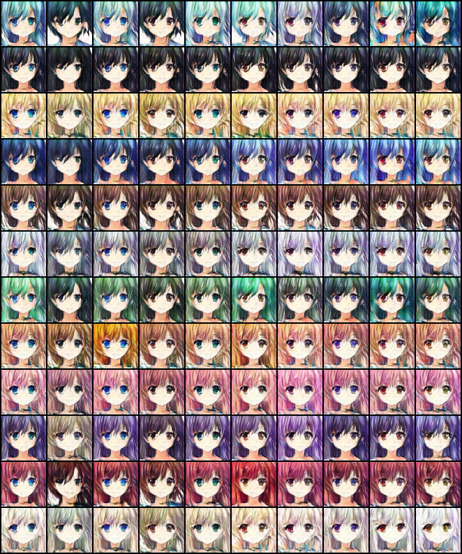

## 1. Task
Given a dataset with different hair and eyes color, we want to learn a generator which can generate an image with certain hair/eyes color.

## 2. Method(very detailed setting)
1. Conditional GAN

   1. Model structure

    ```python
    [GEN_STRUCTURE]
    Generator(
      (text_dense): Sequential(
        (0): Linear(in_features=22, out_features=256, bias=True)
        (1): LeakyReLU(negative_slope=0.01)
      )
      (cat_dense): Linear(in_features=356, out_features=8192, bias=True)
      (conv): Sequential(
        (0): BatchNorm2d(512, eps=1e-05, momentum=0.9, affine=True, track_running_stats=True)
        (1): LeakyReLU(negative_slope=0.01)
        (2): ConvTranspose2d(512, 256, kernel_size=(4, 4), stride=(2, 2), padding=(1, 1))
        (3): BatchNorm2d(256, eps=1e-05, momentum=0.9, affine=True, track_running_stats=True)
        (4): LeakyReLU(negative_slope=0.01)
        (5): ConvTranspose2d(256, 128, kernel_size=(4, 4), stride=(2, 2), padding=(1, 1))
        (6): BatchNorm2d(128, eps=1e-05, momentum=0.9, affine=True, track_running_stats=True)
        (7): LeakyReLU(negative_slope=0.01)
        (8): ConvTranspose2d(128, 64, kernel_size=(4, 4), stride=(2, 2), padding=(1, 1))
        (9): BatchNorm2d(64, eps=1e-05, momentum=0.9, affine=True, track_running_stats=True)
        (10): LeakyReLU(negative_slope=0.01)
        (11): ConvTranspose2d(64, 3, kernel_size=(4, 4), stride=(2, 2), padding=(1, 1))
        (12): Tanh()
      )
    )
    Trainable parameters: 5688387
    [DIS_STRUCTURE]
    Discriminator(
      (text_dense): Sequential(
        (0): Linear(in_features=22, out_features=256, bias=True)
        (1): LeakyReLU(negative_slope=0.01)
      )
      (conv1): Sequential(
        (0): Conv2d(3, 64, kernel_size=(4, 4), stride=(2, 2), padding=(1, 1))
        (1): LeakyReLU(negative_slope=0.01)
        (2): Conv2d(64, 128, kernel_size=(4, 4), stride=(2, 2), padding=(1, 1))
        (3): BatchNorm2d(128, eps=1e-05, momentum=0.9, affine=True, track_running_stats=True)
        (4): LeakyReLU(negative_slope=0.01)
        (5): Conv2d(128, 256, kernel_size=(4, 4), stride=(2, 2), padding=(1, 1))
        (6): BatchNorm2d(256, eps=1e-05, momentum=0.9, affine=True, track_running_stats=True)
        (7): LeakyReLU(negative_slope=0.01)
        (8): Conv2d(256, 512, kernel_size=(4, 4), stride=(2, 2), padding=(1, 1))
        (9): BatchNorm2d(512, eps=1e-05, momentum=0.9, affine=True, track_running_stats=True)
        (10): LeakyReLU(negative_slope=0.01)
      )
      (conv2): Sequential(
        (0): Conv2d(768, 512, kernel_size=(1, 1), stride=(1, 1))
        (1): BatchNorm2d(512, eps=1e-05, momentum=0.9, affine=True, track_running_stats=True)
        (2): LeakyReLU(negative_slope=0.01)
      )
      (out_dense): Sequential(
        (0): Linear(in_features=8192, out_features=512, bias=True)
        (1): LeakyReLU(negative_slope=0.01)
        (2): Linear(in_features=512, out_features=1, bias=True)
        (3): Sigmoid()
      )
    )
    ```

   2.  Optimizer and Criterion

     ```python
     # optimizer
     gen_optimizer = torch.optim.Adam(self.gen.parameters(), lr = opt.glr, betas=(0.5, 0.999))
     dis_optimizer = torch.optim.Adam(self.dis.parameters(), lr = opt.dlr, betas=(0.5, 0.999))
     # criterion
     criterion = nn.BCELoss()
     ```

2. ACGAN

    1. Model structure

     ```python
     [GEN_STRUCTURE]
     Generator(
       (text_dense): Sequential(
         (0): Linear(in_features=22, out_features=256, bias=True)
         (1): LeakyReLU(negative_slope=0.01)
       )
       (cat_dense): Linear(in_features=356, out_features=8192, bias=True)
       (conv): Sequential(
         (0): BatchNorm2d(512, eps=1e-05, momentum=0.9, affine=True, track_running_stats=True)
         (1): LeakyReLU(negative_slope=0.01)
         (2): ConvTranspose2d(512, 256, kernel_size=(4, 4), stride=(2, 2), padding=(1, 1))
         (3): BatchNorm2d(256, eps=1e-05, momentum=0.9, affine=True, track_running_stats=True)
         (4): LeakyReLU(negative_slope=0.01)
         (5): ConvTranspose2d(256, 128, kernel_size=(4, 4), stride=(2, 2), padding=(1, 1))
         (6): BatchNorm2d(128, eps=1e-05, momentum=0.9, affine=True, track_running_stats=True)
         (7): LeakyReLU(negative_slope=0.01)
         (8): ConvTranspose2d(128, 64, kernel_size=(4, 4), stride=(2, 2), padding=(1, 1))
         (9): BatchNorm2d(64, eps=1e-05, momentum=0.9, affine=True, track_running_stats=True)
         (10): LeakyReLU(negative_slope=0.01)
         (11): ConvTranspose2d(64, 3, kernel_size=(4, 4), stride=(2, 2), padding=(1, 1))
         (12): Tanh()
       )
     )
     Trainable parameters: 5688387
     [DIS_STRUCTURE]
     Discriminator(
       (conv): Sequential(
         (0): Conv2d(3, 64, kernel_size=(4, 4), stride=(2, 2), padding=(1, 1))
         (1): LeakyReLU(negative_slope=0.01)
         (2): Conv2d(64, 128, kernel_size=(4, 4), stride=(2, 2), padding=(1, 1))
         (3): BatchNorm2d(128, eps=1e-05, momentum=0.9, affine=True, track_running_stats=True)
         (4): LeakyReLU(negative_slope=0.01)
         (5): Conv2d(128, 256, kernel_size=(4, 4), stride=(2, 2), padding=(1, 1))
         (6): BatchNorm2d(256, eps=1e-05, momentum=0.9, affine=True, track_running_stats=True)
         (7): LeakyReLU(negative_slope=0.01)
         (8): Conv2d(256, 512, kernel_size=(4, 4), stride=(2, 2), padding=(1, 1))
         (9): BatchNorm2d(512, eps=1e-05, momentum=0.9, affine=True, track_running_stats=True)
         (10): LeakyReLU(negative_slope=0.01)
       )
       (real_dense): Sequential(
         (0): Linear(in_features=8192, out_features=512, bias=True)
         (1): LeakyReLU(negative_slope=0.01)
         (2): Linear(in_features=512, out_features=1, bias=True)
         (3): Sigmoid()
       )
       (hair_dense): Sequential(
         (0): Linear(in_features=8192, out_features=512, bias=True)
         (1): LeakyReLU(negative_slope=0.01)
         (2): Linear(in_features=512, out_features=12, bias=True)
         (3): LogSoftmax()
       )
       (eye_dense): Sequential(
         (0): Linear(in_features=8192, out_features=512, bias=True)
         (1): LeakyReLU(negative_slope=0.01)
         (2): Linear(in_features=512, out_features=10, bias=True)
         (3): LogSoftmax()
       )
     )
     ```

    2. Optimizer and Criterion

     ```python
     # optimizer
     gen_optimizer = torch.optim.Adam(self.gen.parameters(), lr = opt.glr, betas=(0.5, 0.999))
     dis_optimizer = torch.optim.Adam(self.dis.parameters(), lr = opt.dlr, betas=(0.5, 0.999))
     # criterion
     real_criterion = nn.BCELoss()
     class_crierion = nn.NLLLoss()
     ```

## 3. Experiment
1. CGAN vs ACGAN


| Model   | ACGAN                            | CGAN                            |
| ------- | -------------------------------- | ------------------------------- |
| Process |  |  |

   ACGAN is more easily to mode collapse, and its ability to learn accurate color is worse than CGAN.

   CGAN can learn high quality image with right condition. However, it is also easy to mode collapse at around 30 epochs.

2. Embed 22 vs 120

   | CGAN(120)                            | CGAN(22)                            |
   | ------------------------------------ | ----------------------------------- |
   | 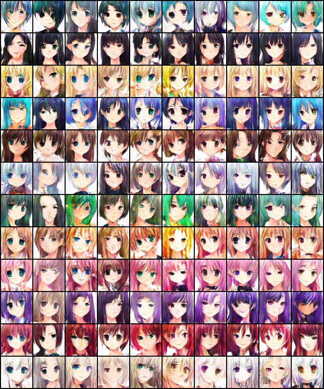  | 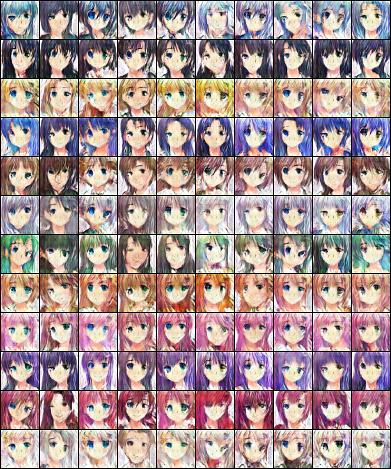  |
   | ACGAN(120)                           | ACGAN(22)                           |
   | 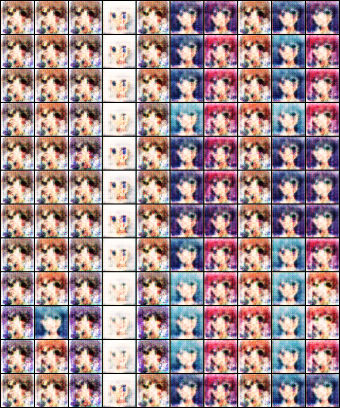 | 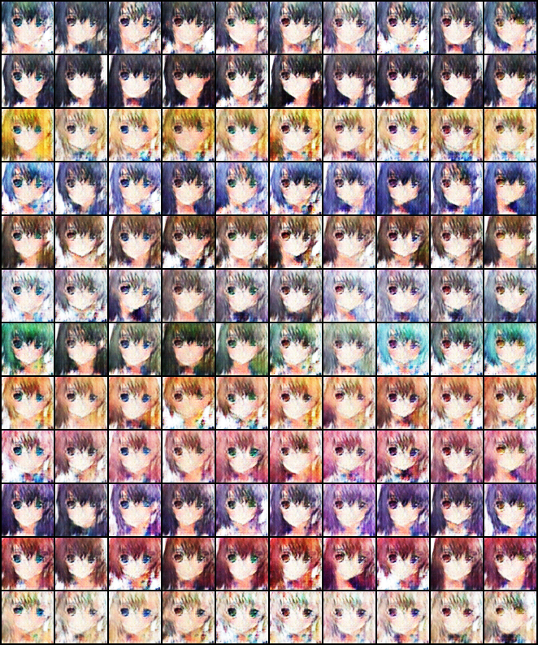 |

   Compare two column, embed22 can have a better performance than embed120 because the distribution of embed120 is too sparse so that it is quite hard to learn accurate color.

   Besides, we can notice an interesting fact. When we tried out ACGAN(120), we found that the model always crashed no matter how we tuned it. We guess that it is also because embed120 is too sparse.

3. nf 16 vs 64 vs 128

   | CGAN<br />(embed=22,nf=128) | 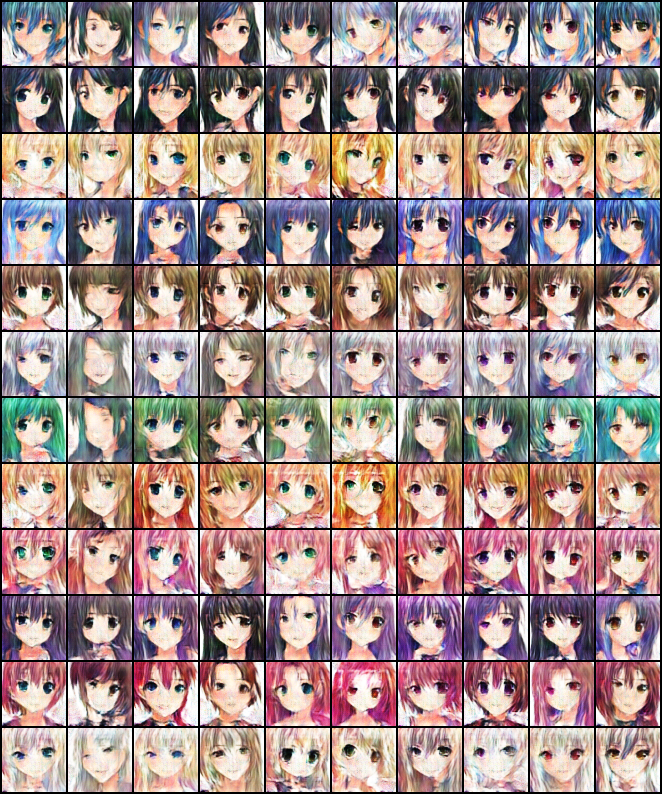 |
   | --------------------------- | ----------------------------------- |
   | CGAN<br />(embed=22,nf=64)  |   |
   | CGAN<br />(embed=22,nf=16)  | 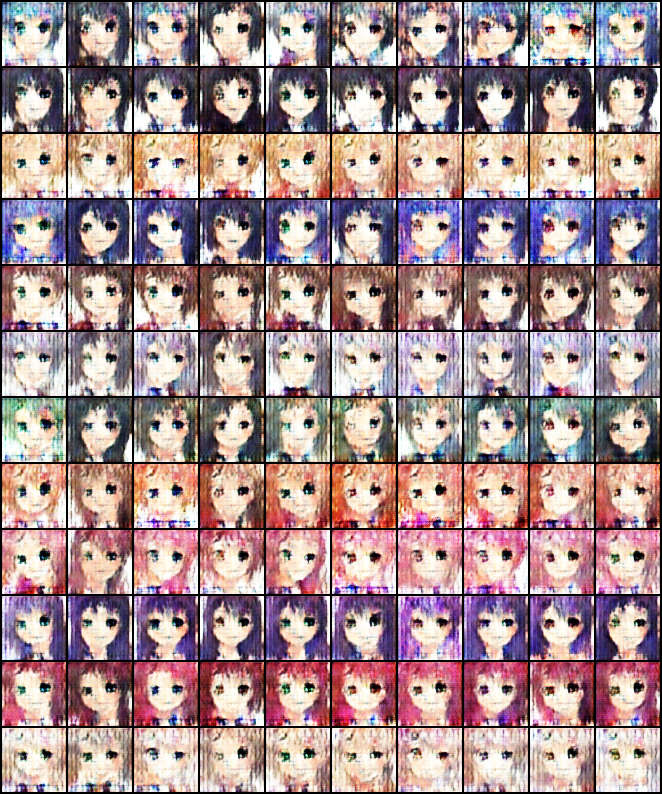  |


   We switch number of feature in CNN from 16 to 64 then to 128.

   We found out that as the nf increases, the resolution of the generated image becomes higher. However, the training time also increases as a trade-off.

4. Embed 6

   We propose a novel idea called "rgb embed". 

   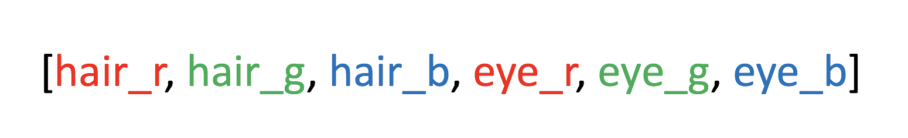

   We can only use "6-dim" to represent the condition. We notice that although the generated images are a little low-quality than "22-dim", but the most coolest advantage is that it can inference any color giving an rgb code.  

   | CGAN(embed = 6)                  |
   | -------------------------------- |
   | 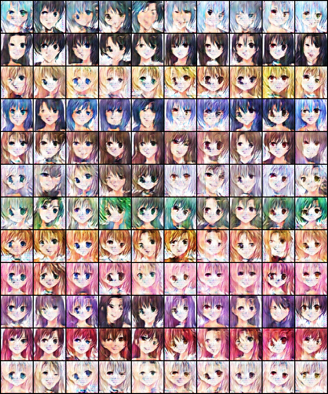 |
## 4. Inference
### Basic

1. Pairs of hair/eye colors

   | Row  | 1                    | 2                      | 3                 | 4                    | 5                       |
   | ---- | -------------------- | ---------------------- | ----------------- | -------------------- | ----------------------- |
   | Pair | pink hair black eyes | black hair purple eyes | red hair red eyes | aqua hair green eyes | blonde hair orange eyes |

   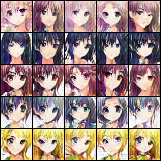

2. Fix eye change hair

   

3. Fix hair change eye

   

4. Row: hair, Col:eye

   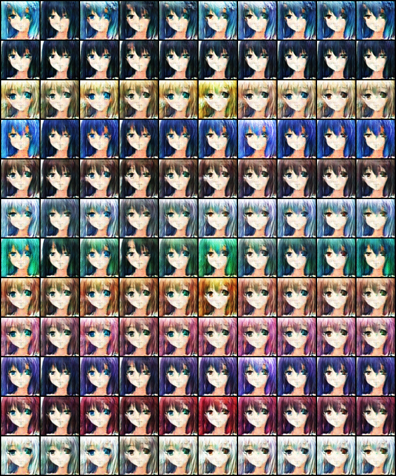

### Advance(Use color embed)

1. Given arbitrary hair and eye colors

   ``Todo``

2. Big color map

   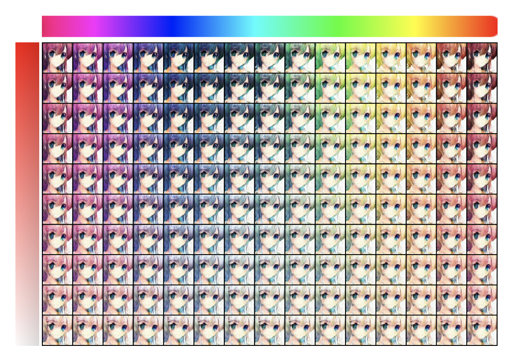

3. Bigger color map

   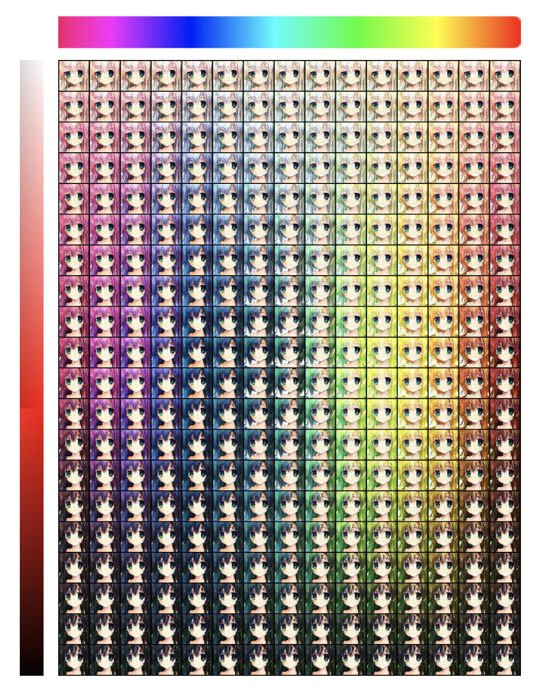


## 5. Mix the notion of wgan

I try to mix the concept of WGAN and CGAN. I do the following revision based on WGAN.
1. remove ``sigmoid`` in the last layer.
2. remove ``log`` in the loss function.
3. weight clipping
4. use rmsprop
But the result turns out weird.(QQ)

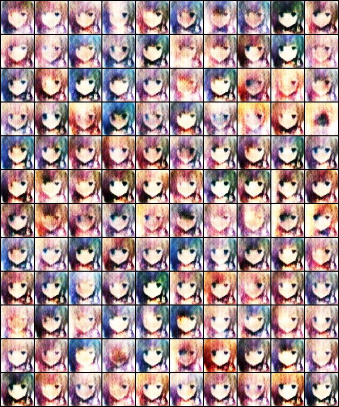